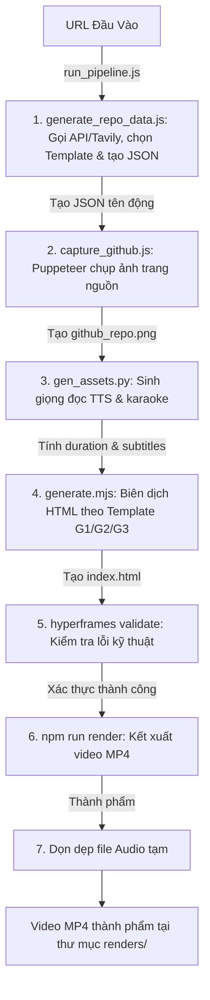

# 🚀 Quy Trình Tự Động Hóa Tạo Video Tin Tức & Review (Workflow)

Tài liệu này hướng dẫn chi tiết từng bước tạo video Review GitHub Repository từ kịch bản thô hoặc tự động hóa hoàn toàn từ URL (GitHub, Docker, Web) sang video `.mp4` hoàn chỉnh.

---

## ⚡Cách chạy 1: Giao Diện Đồ Họa (Web UI Dashboard)

Dự án giờ đây đã được trang bị một Web UI cực kỳ chuyên nghiệp giúp bạn tạo nhiều video cùng lúc với thao tác trực quan.


1. Khởi động máy chủ UI:
   ```bash
   npm run start
   ```
2. Mở trình duyệt web và truy cập:
   ```
   http://localhost:3001
   ```
3. Tại giao diện, bạn có thể nhập nhiều URL cùng lúc (bấm `+ Add More URL`), theo dõi log hệ thống chạy realtime và **xem trực tiếp video** ngay trên trình duyệt khi quá trình hoàn tất.

---

## ⚡Cách chạy 2: Luồng Tự Động Hóa Qua Terminal (CLI)

Nếu muốn tạo nhanh video review cho một URL bất kỳ từ terminal, bạn chỉ cần chạy một câu lệnh duy nhất:

```bash
node pipeline/run_pipeline.js <url_bất_kỳ>
```

**Ví dụ:**
```bash
node pipeline/run_pipeline.js https://github.com/pnpm/pnpm
node pipeline/run_pipeline.js https://hub.docker.com/_/nginx
node pipeline/run_pipeline.js https://vitejs.dev
```

---

### Sơ đồ hoạt động của Pipeline:



---

> [!IMPORTANT]
> Tất cả các bước thực hiện thủ công dưới đây đều được chạy trực tiếp từ thư mục gốc của dự án `VNP_HyperFrames`.

### Bước 1: Thu thập thông tin và tạo kịch bản (`generate_repo_data.js`)
*   **Mô tả**: Dựa vào URL đầu vào, hệ thống tự động phân loại thành 3 nhóm (Group 1: GitHub, Group 2: Docker, Group 3: Web). Sau đó, gọi API hoặc dùng Tavily AI để lấy nội dung, sinh kịch bản và **chỉ định template tương ứng**.
*   **Lệnh thực thi**:
    ```bash
    node pipeline/generate_repo_data.js https://github.com/pnpm/pnpm
    ```
*   **Đầu ra (Output)**: Tệp JSON kịch bản dynamic (không ghi đè) với định dạng tên:
    ```txt
    data/<tên-video>-<DD>-<MM>-<YYYY>-<HH>-<mm>.json
    ```
    Ví dụ: `data/pnpm-20-05-2026-16-06.json`, `data/nginx-20-05-2026-16-06.json`

#### Các template hiện có

| Template | Nền tảng | Thư mục |
|---|---|---|
| `G1_github` | GitHub | `templates/G1_github/` |
| `G2_docker` | Docker Hub | `templates/G2_docker/` |
| `G3_web` | Web bất kỳ | `templates/G3_web/` |

#### Các format video theo nền tảng

**GitHub:**
- `tool_review_quick_demo` — Repo dạng tool/app/CLI
- `developer_integration_brief` — Repo dạng thư viện/framework
- `knowledge_map_resource_digest` — Repo dạng awesome/curated list
- `dataset_explainer` — Repo dạng dataset/benchmark
- `repo_overview_with_use_cases` — Repo không xác định rõ

**Docker:**
- `container_quick_start` — Official/base image
- `self_host_setup_guide` — Ứng dụng self-hosted
- `dev_workflow_image_brief` — Dev/CI runtime
- `container_overview` — Image không xác định rõ

**Web:**
- `web_docs_explainer` — Trang tài liệu
- `web_tool_overview` — Trang tool/SDK
- `web_article_digest` — Bài viết/phân tích
- `web_product_brief` — Trang sản phẩm
- `web_context_digest` — Web không xác định rõ

> [!TIP]
> **Tavily AI cho Web URL**: Với các link Web thông thường, hệ thống sẽ dùng Tavily để tóm tắt và phân loại nội dung chính xác. Cấu hình trong file `.env` hoặc trong terminal:
> `set TAVILY_API_KEY=your_api_key_here` (Windows) hoặc `export TAVILY_API_KEY=...` (Mac/Linux).

---

### Bước 2: Chụp ảnh trang tự động (`capture_github.js`)
*   **Mô tả**: Sử dụng thư viện Puppeteer bật Chrome ẩn danh, tự động truy cập URL nguồn, dọn dẹp các banner quảng cáo, căn chỉnh bố cục hợp lý và chụp ảnh màn hình dọc làm nguyên liệu cho Cảnh 1. Chế độ Light/Dark mode được tinh chỉnh mượt mà để tôn lên giao diện UI của từng template.
*   **Lệnh thực thi**:
    ```bash
    node pipeline/capture_github.js https://github.com/pnpm/pnpm
    ```
*   **Đầu vào (Input)**: URL trang nguồn.
*   **Đầu ra (Output)**: Ảnh chụp màn hình dọc siêu dài: `assets/images/github_repo.png`

---

### Bước 3: Tạo giọng đọc và mốc thời gian phụ đề (`gen_assets.py`)
*   **Mô tả**: Tự động chuyển văn bản thành giọng nói (TTS) tiếng Việt và tính toán mốc thời gian hiển thị karaoke cho từng từ.
*   **Lệnh thực thi**:
    ```bash
    python pipeline/gen_assets.py data/<tên_file_json>
    ```
*   **Đầu vào (Input)**: Tệp JSON kịch bản.
*   **Đầu ra (Output)**:
    1.  Tự động sinh các tệp âm thanh giọng đọc dạng sóng: `assets/audio/github-review_scene_*.wav`
    2.  Tự động cập nhật trực tiếp vào tệp JSON kịch bản các thông tin:
        *   Mốc thời gian bắt đầu/kết thúc âm thanh cảnh (`audio_start`, `audio_duration`).
        *   Mảng phụ đề karaoke chi tiết khớp từng mili-giây (`transcript`).
        *   Tổng thời lượng toàn bộ video (`duration`).

---

### Bước 4: Biên dịch sang giao diện video HTML (`generate.mjs`)
*   **Mô tả**: Trình biên dịch đọc dữ liệu từ tệp JSON đã có đủ mốc thời gian để lắp ghép các thẻ HTML giao diện và viết mã chuyển động GSAP tương ứng. Quá trình này sẽ **tự động phân luồng, nạp template UI** dựa trên loại nguồn:
    - `G1_github`: Template chuyên dụng cho mã nguồn GitHub.
    - `G2_docker`: Template cho hệ thống/container.
    - `G3_web`: Template Neon Glassmorphism cho web/bài viết (Grid Layout, Timeline, Metric Cards).
*   **Lệnh thực thi**:
    ```bash
    node pipeline/generate.mjs data/<tên_file_json>
    ```
*   **Đầu vào (Input)**: Tệp JSON kịch bản đã xử lý ở Bước 2.
*   **Đầu ra (Output)**: Tệp mã nguồn cấu trúc video tổng thể: `index.html` tại thư mục gốc của dự án.

---

### Bước 5: Kiểm tra và xác thực chất lượng mã (`npx hyperframes validate`)
*   **Mô tả**: Chạy trình giả lập kiểm tra tĩnh và kiểm tra chạy thực tế trên Chrome không đầu để phát hiện sớm các lỗi cú pháp HTML, lỗi JavaScript của GSAP, lỗi thiếu file ảnh/âm thanh hoặc lỗi tương phản màu chữ.
*   **Lệnh thực thi**:
    ```bash
    npx hyperframes validate
    ```
*   **Đầu ra (Output)**: Báo cáo xác thực (ví dụ: *No console errors* - không có lỗi console).

---

### Bước 6: Xuất video thành phẩm (`npm run render`)
*   **Mô tả**: Kích hoạt engine HyperFrames đọc tệp `index.html`, kết hợp Puppeteer để chụp hình từng khung ảnh động và dùng FFmpeg đóng gói âm thanh + hình ảnh thành tệp phim hoàn chỉnh.
*   **Lệnh thực thi**:
    ```bash
    npm run render
    ```
*   **Đầu ra (Output)**: Tệp video MP4 thành phẩm chất lượng cao nằm trong thư mục `renders/` với định dạng tên: `renders/VNP_HyperFrames_YYYY-MM-DD_HH-MM-SS.mp4`.

---

### Bước 7: Dọn dẹp hệ thống (Clean-up)
*   **Mô tả**: Ngay khi video render thành công, Pipeline tự động rà quét và **xóa toàn bộ các tệp `.wav` rác** trong thư mục `assets/audio/` để giải phóng bộ nhớ ổ cứng, giữ không gian làm việc sạch sẽ.

# Cấu trúc dự án:

```text
VNP_HyperFrames/
├── assets/
│   ├── audio/              # Chứa audio tạm thời (Tự động bị xóa sau render)
│   ├── images/             # Ảnh chụp Screenshot tự động
│   └── styles/
│       ├── components.css
│       └── fonts.css
├── data/                   # Chứa các file kịch bản JSON (Tên sinh tự động theo ngày)
├── docs/                   # Tài liệu kiến trúc và hướng dẫn
├── pipeline/               # Toàn bộ scripts điều phối pipeline
│   ├── capture_github.js   # Script chụp ảnh màn hình Puppeteer
│   ├── gen_assets.py       # Sinh AI TTS & Karaoke Timing
│   ├── generate.mjs        # Biên dịch tệp JSON + Template ra index.html
│   ├── generate_repo_data.js  # Module phân loại URL, gọi API/AI sinh Data
│   ├── run_pipeline.js     # Trình điều phối chạy tuần tự 7 Bước
│   └── ui_server.js        # Máy chủ Backend cấp giao diện Web (Express - Port 3001)
├── public/                 # Giao diện Web UI (HTML/CSS/JS frontend)
├── renders/                # Video MP4 thành phẩm
├── templates/              # Hệ thống Multi-Template (Phân tách theo loại dữ liệu)
│   ├── G1_github/          # UI/CSS cho GitHub Repo
│   ├── G2_docker/          # UI/CSS cho Docker Hub
│   └── G3_web/             # UI/CSS Neon Glassmorphism (Cho Website/Tech News)
├── package.json
└── README.md               # Tài liệu bạn đang đọc
```
