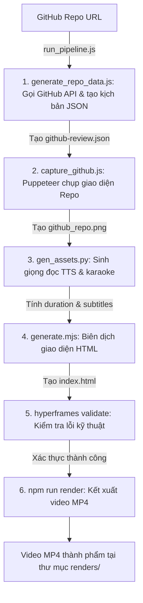

# 🚀 Quy Trình Tự Động Hóa Tạo Video Tin Tức & Review (Workflow)

Tài liệu này hướng dẫn chi tiết từng bước tạo video Review GitHub Repository từ kịch bản thô hoặc tự động hóa hoàn toàn từ URL GitHub sang video `.mp4` hoàn chỉnh.

---

## ⚡ Cực Nhanh: Luồng Tự Động Hóa Hoàn Toàn (End-to-End Pipeline)

Nếu muốn tạo nhanh video review cho một repository GitHub bất kỳ, bạn chỉ cần chạy một câu lệnh duy nhất:

```bash
node run_pipeline.js <github_repo_url>
```

**Ví dụ:**
```bash
node run_pipeline.js https://github.com/pnpm/pnpm
```

### Sơ đồ hoạt động của Pipeline:



---

> [!IMPORTANT]
> Tất cả các bước thực hiện thủ công dưới đây đều được chạy từ bên trong thư mục `my-video/`. Vui lòng chuyển thư mục trước khi thực hiện:
> ```bash
> cd my-video
> ```

### Bước 1: Thu thập thông tin repo và tạo kịch bản (`generate_repo_data.js`)
*   **Mô tả**: Tách thông tin `owner` và `repo` từ đường dẫn GitHub, gọi API công khai của GitHub để lấy: tên dự án, mô tả, số sao, ngôn ngữ lập trình chính. Sau đó, kết hợp các thông tin này vào mẫu kịch bản tiếng Việt có cấu trúc 8 phân cảnh review chuẩn.
*   **Lệnh thực thi**:
    ```bash
    node generate_repo_data.js https://github.com/pnpm/pnpm
    ```
*   **Đầu ra (Output)**: Tệp JSON kịch bản dynamic tại: `data/github-review.json` (Đường dẫn tuyệt đối: [github-review.json](file:///d:/hyperframes/my-video/data/github-review.json))

---

### Bước 2: Chụp ảnh GitHub tự động (`capture_github.js`)
*   **Mô tả**: Sử dụng thư viện Puppeteer bật Chrome ẩn danh, tự động truy cập GitHub Repo, dọn dẹp các banner quảng cáo, căn chỉnh bố cục hợp lý và chụp ảnh màn hình dọc làm nguyên liệu cho Cảnh 1.
*   **Lệnh thực thi**:
    ```bash
    node capture_github.js https://github.com/pnpm/pnpm
    ```
*   **Đầu vào (Input)**: URL trang GitHub.
*   **Đầu ra (Output)**: Ảnh chụp màn hình dọc siêu dài: `assets/images/github_repo.png`

---

### Bước 3: Tạo giọng đọc và mốc thời gian phụ đề (`gen_assets.py`)
*   **Mô tả**: Tự động chuyển văn bản thành giọng nói (TTS) tiếng Việt và tính toán mốc thời gian hiển thị karaoke cho từng từ.
*   **Lệnh thực thi**:
    ```bash
    python gen_assets.py data/github-review.json
    ```
*   **Đầu vào (Input)**: Tệp JSON kịch bản.
*   **Đầu ra (Output)**:
    1.  Tự động sinh các tệp âm thanh giọng đọc dạng sóng: `assets/audio/github-review_scene_*.wav`
    2.  Tự động cập nhật trực tiếp vào tệp JSON kịch bản các thông tin:
        *   Mốc thời gian bắt đầu/kết thúc âm thanh cảnh (`audio_start`, `audio_duration`).
        *   Mảng phụ đề karaoke chi tiết khớp từng mili-giây (`transcript`).
        *   Tổng thời lượng toàn bộ video (`duration`).

---

### Bước 4: Biên dịch sang giao diện video HTML (`generate.mjs`)
*   **Mô tả**: Trình biên dịch sẽ đọc dữ liệu từ tệp JSON đã có đủ mốc thời gian để lắp ghép các thẻ HTML giao diện (Browser Mockup, text headline, nhân vật Shiba) và viết các dòng mã chuyển động GSAP tương ứng.
*   **Lệnh thực thi**:
    ```bash
    node generate.mjs data/github-review.json
    ```
*   **Đầu vào (Input)**: Tệp JSON kịch bản đã xử lý ở Bước 2.
*   **Đầu ra (Output)**: Tệp mã nguồn cấu trúc video tổng thể: `index.html` tại thư mục gốc của dự án.

---

### Bước 5: Kiểm tra và xác thực chất lượng mã (`npx hyperframes validate`)
*   **Mô tả**: Chạy trình giả lập kiểm tra tĩnh và kiểm tra chạy thực tế trên Chrome không đầu để phát hiện sớm các lỗi cú pháp HTML, lỗi JavaScript của GSAP, lỗi thiếu file ảnh/âm thanh hoặc lỗi tương phản màu chữ.
*   **Lệnh thực thi**:
    ```bash
    npx hyperframes validate
    ```
*   **Đầu ra (Output)**: Báo cáo xác thực (ví dụ: *No console errors* - không có lỗi console).

---

### Bước 6: Xuất video thành phẩm (`npm run render`)
*   **Mô tả**: Kích hoạt engine HyperFrames đọc tệp `index.html`, kết hợp Puppeteer để chụp hình từng khung ảnh động và dùng FFmpeg đóng gói âm thanh + hình ảnh thành tệp phim hoàn chỉnh.
*   **Lệnh thực thi**:
    ```bash
    npm run render
    ```
*   **Đầu ra (Output)**: Tệp video MP4 thành phẩm chất lượng cao nằm trong thư mục `renders/` với định dạng tên: `renders/my-video_YYYY-MM-DD_HH-MM-SS.mp4`.

# Cấu trúc dự án:

```text
VNP_HyperFrames/
├── assets/
│   ├── audio/
│   │   └── github-review_scene_*.wav
│   ├── images/
│   │   └── github_repo.png
│   └── styles/
│       ├── components.css
│       └── fonts.css
├── data/
│   ├── github-review.json
│   ├── html-template/
│   │   ├── index.html
│   │   ├── scene_01_opening_and_intro.html
│   │   └── ... (các scene khác)
│   └── script/
│       ├──generate_repo_data.js
│       └──scene_01_opening_and_intro.js
│       
├── renders/        # Video đầu ra sẽ nằm ở đây
├── nodes_modules/
├── .gitignore
├── package.json
├── run_pipeline.js   # Script chạy toàn bộ luồng
└── ... (các file khác)
```