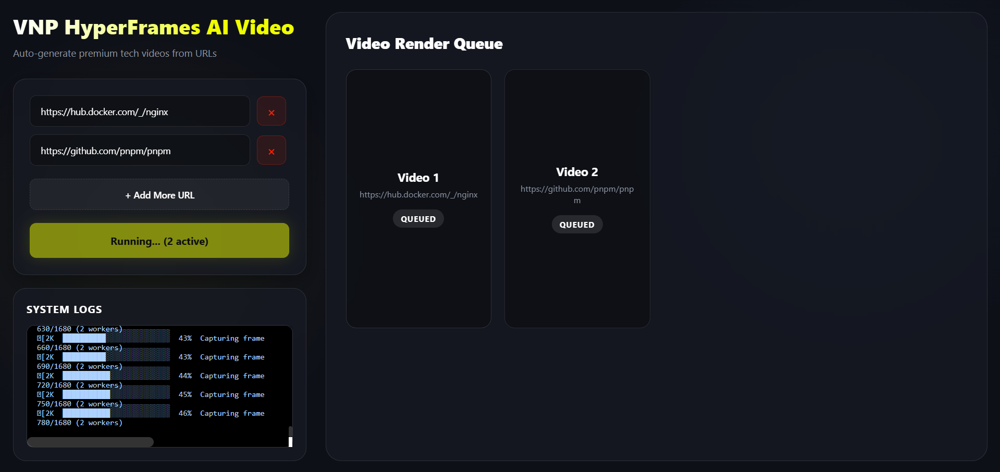
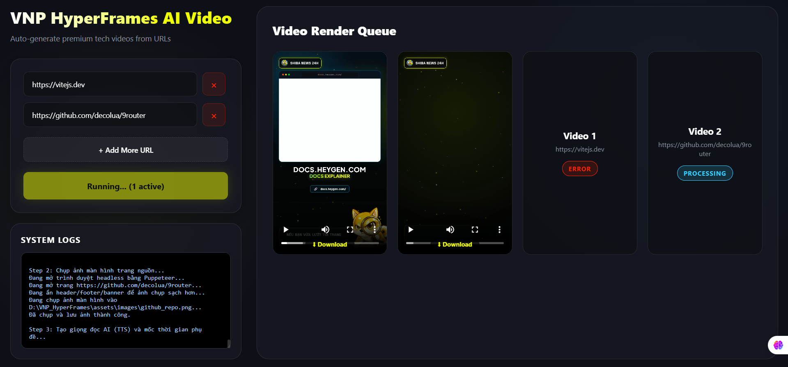
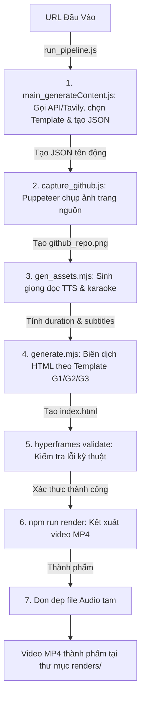

# 🚀 Quy Trình Tự Động Hóa Tạo Video Tin Tức & Review (Workflow)

Tài liệu này hướng dẫn chi tiết từng bước tạo video Review GitHub Repository từ kịch bản thô hoặc tự động hóa hoàn toàn từ URL (GitHub, Docker, Web) sang video `.mp4` hoàn chỉnh.

---

## ⚡Cách chạy 1: Giao Diện Đồ Họa (Web UI Dashboard)

Dự án giờ đây đã được trang bị một Web UI cực kỳ chuyên nghiệp giúp bạn tạo nhiều video cùng lúc với thao tác trực quan.



1. Khởi động máy chủ UI:
   ```bash
   npm run start
   ```
2. Mở trình duyệt web và truy cập:
   ```
   http://localhost:3001
   ```
3. Tại giao diện, bạn có thể nhập nhiều URL cùng lúc (bấm `+ Add More URL`), theo dõi log hệ thống chạy realtime và **xem trực tiếp video** ngay trên trình duyệt khi quá trình hoàn tất.

---

## ⚡Cách chạy 2: Luồng Tự Động Hóa Qua Terminal (CLI)

Nếu muốn tạo nhanh video review cho một URL bất kỳ từ terminal, bạn chỉ cần chạy một câu lệnh duy nhất:

```bash
node pipeline/run_pipeline.js <url_bất_kỳ>
```

**Ví dụ:**
```bash
node pipeline/run_pipeline.js https://github.com/honojs/hono
node pipeline/run_pipeline.js https://hub.docker.com/r/ollama/ollama
node pipeline/run_pipeline.js https://supabase.com
```

---

## ⚡Cách chạy 3: Chạy ứng dụng Desktop (Electron App)

Dự án hỗ trợ khởi chạy trực tiếp dưới dạng ứng dụng desktop chuyên nghiệp qua Electron:

1. Khởi động ứng dụng desktop:
   ```bash
   npm run desktop
   ```
2. Cửa sổ ứng dụng desktop sẽ tự động khởi động và tải giao diện điều khiển cấu hình & render video.

---

### Sơ đồ hoạt động của Pipeline:



---

> [!IMPORTANT]
> Tất cả các bước thực hiện thủ công dưới đây đều được chạy trực tiếp từ thư mục gốc của dự án `VNP_HyperFrames`.

### Bước 1: Thu thập thông tin và tạo kịch bản (`main_generateContent.js`)
*   **Mô tả**: Dựa vào URL đầu vào, hệ thống tự động phân loại thành 3 nhóm (Group 1: GitHub, Group 2: Docker, Group 3: Web). Sau đó, gọi API hoặc dùng Tavily AI để lấy nội dung, sinh kịch bản bằng AI (OpenAI/OpenRouter) theo từng format và chỉ định template tương ứng.
*   **Lệnh thực thi**:
    ```bash
    node pipeline/main_generateContent.js https://github.com/pnpm/pnpm
    ```
*   **Đầu ra (Output)**: Tệp JSON kịch bản dynamic (không ghi đè) với định dạng tên:
    ```txt
    data/<tên-video>-<DD>-<MM>-<YYYY>-<HH>-<mm>.json
    ```
    Ví dụ: `data/pnpm-20-05-2026-16-06.json`, `data/nginx-20-05-2026-16-06.json`

#### Các template hiện có

| Template | Nền tảng | Thư mục |
|---|---|---|
| `G1_github` | GitHub | `templates/G1_github/` |
| `G2_docker` | Docker Hub | `templates/G2_docker/` |
| `G3_web` | Web bất kỳ | `templates/G3_web/` |

#### Các format video theo nền tảng

**Group 1: GitHub:**
- `tool_review_quick_demo` — Repo dạng tool/app/CLI
- `developer_integration_brief` — Repo dạng thư viện/framework
- `knowledge_map_resource_digest` — Repo dạng awesome/curated list
- `dataset_explainer` — Repo dạng dataset/benchmark
- `repo_overview_with_use_cases` — Repo không xác định rõ

**Group 2: Docker:**
- `container_quick_start` — Official/base image
- `self_host_setup_guide` — Ứng dụng self-hosted
- `dev_workflow_image_brief` — Dev/CI runtime
- `container_overview` — Image không xác định rõ

**Group 3: Web:**
- `web_docs_explainer` — Trang tài liệu
- `web_tool_overview` — Trang tool/SDK
- `web_article_digest` — Bài viết/phân tích
- `web_product_brief` — Trang sản phẩm
- `web_context_digest` — Web không xác định rõ

## Cấu trúc Mẫu video (Templates)

### 1. Phân chia theo Nhóm mẫu (Group)
Thư mục `templates/` được phân chia thành các thư mục con tương ứng với từng nhóm mẫu:
* **`G1_github/`**: Chuyên phục vụ mẫu giới thiệu repository GitHub.
* **`G2_docker/`**: Chuyên phục vụ mẫu cài đặt Docker container.
* **`G3_web/`**: Chuyên phục vụ mẫu review các trang web/tool tổng hợp.

### 2. Cấu trúc của mỗi Thư mục Mẫu
Trong mỗi thư mục mẫu (ví dụ `templates/G1_github/`), mã nguồn được tổ chức thành 3 thành phần chính:

* **`style.css` (CSS Stylesheet)**:
  Định nghĩa toàn bộ hệ thống màu sắc (Color Tokens), typography (Font chữ), kích thước, hiệu ứng hover, bóng đổ (glow), căn chỉnh bố cục Flexbox/Grid và các hiệu ứng chuyển động CSS (micro-animations như hạt bụi bay, hiệu ứng kính phản chiếu `.browser-glass-shine`, v.v.).
* **`scenes.mjs` (Các Cảnh phim cụ thể)**:
  * Chứa mã nguồn cấu trúc HTML và các đoạn script hiệu ứng GSAP cho từng cảnh (từ Cảnh 1 đến Cảnh 8).
  * File sử dụng câu lệnh `switch (i)` để render ra giao diện tương ứng theo thứ tự cảnh:
    * *Cảnh 1 (case 0)*: Khung trình duyệt web mô phỏng (`.browser-frame`) chứa hình ảnh cuộn của Github repository.
    * *Cảnh 2 (case 1)*: Bố cục Bento Grid (`.bento-container` gồm `.bento-card full` và `.bento-grid-2`).
    * *Cảnh 7 (case 6)*: Cửa sổ giao diện dòng lệnh (`.terminal-frame`).
* **`template.mjs` (Trình biên dịch & Lắp ghép)**:
  Đóng vai trò là file "khung xương" nhận dữ liệu kịch bản JSON từ AI và thực hiện:
  * Lần lượt gọi hàm dựng cảnh `getHyperframesReviewScene` từ file `scenes.mjs` để lấy về HTML và GSAP code cho từng cảnh.
  * Tự động liên kết các file âm thanh giọng đọc (TTS) và hiệu ứng âm thanh (SFX).
  * Nhúng thư viện GSAP và thiết lập thuật toán chạy phụ đề Karaoke động đồng bộ với âm thanh.
  * Trả về toàn bộ trang HTML hoàn chỉnh cho composition.

> [!TIP]
> **Tavily AI cho Web URL**: Với các link Web thông thường, hệ thống sẽ dùng Tavily để tóm tắt và phân loại nội dung chính xác. Cấu hình trong file `.env` hoặc trong terminal:
> `set TAVILY_API_KEY=your_api_key_here` (Windows) hoặc `export TAVILY_API_KEY=...` (Mac/Linux).

---

### Bước 2: Chụp ảnh trang tự động (`capture_github.js`)
*   **Mô tả**: Sử dụng thư viện Puppeteer bật Chrome ẩn danh, tự động truy cập URL nguồn, dọn dẹp các banner quảng cáo, căn chỉnh bố cục hợp lý và chụp ảnh màn hình dọc làm nguyên liệu cho Cảnh 1. Chế độ Light/Dark mode được tinh chỉnh mượt mà để tôn lên giao diện UI của từng template.
*   **Lệnh thực thi**:
    ```bash
    node pipeline/capture_github.js https://github.com/pnpm/pnpm
    ```
*   **Đầu vào (Input)**: URL trang nguồn.
*   **Đầu ra (Output)**: Ảnh chụp màn hình dọc siêu dài: `assets/images/github_repo.png`

---

### Bước 3: Tạo giọng đọc và mốc thời gian phụ đề (`gen_assets.mjs`)
*   **Mô tả**: Tự động chuyển văn bản thành giọng nói (TTS) tiếng Việt bằng Node.js và tính toán mốc thời gian hiển thị karaoke cho từng từ.
*   **Lệnh thực thi**:
    ```bash
    node pipeline/gen_assets.mjs data/<tên_file_json>
    ```
*   **Đầu vào (Input)**: Tệp JSON kịch bản.
*   **Đầu ra (Output)**:
    1.  Tự động sinh các tệp âm thanh giọng đọc dạng sóng: `assets/audio/github-review_scene_*.wav`
    2.  Tự động cập nhật trực tiếp vào tệp JSON kịch bản các thông tin:
        *   Mốc thời gian bắt đầu/kết thúc âm thanh cảnh (`audio_start`, `audio_duration`).
        *   Mảng phụ đề karaoke chi tiết khớp từng mili-giây (`transcript`).
        *   Tổng thời lượng toàn bộ video (`duration`).

---

### Bước 4: Biên dịch sang giao diện video HTML (`generate.mjs`)
*   **Mô tả**: Trình biên dịch đọc dữ liệu từ tệp JSON đã có đủ mốc thời gian để lắp ghép các thẻ HTML giao diện và viết mã chuyển động GSAP tương ứng. Quá trình này sẽ **tự động phân luồng, nạp template UI** dựa trên loại nguồn:
    - `G1_github`: Template chuyên dụng cho mã nguồn GitHub.
    - `G2_docker`: Template cho hệ thống/container.
    - `G3_web`: Template Neon Glassmorphism cho web/bài viết (Grid Layout, Timeline, Metric Cards).
*   **Lệnh thực thi**:
    ```bash
    node pipeline/generate.mjs data/<tên_file_json>
    ```
*   **Đầu vào (Input)**: Tệp JSON kịch bản đã xử lý ở Bước 2.
*   **Đầu ra (Output)**: Tệp mã nguồn cấu trúc video tổng thể: `index.html` tại thư mục gốc của dự án.

* Quy trình generate của video:
1. Script `pipeline/generate.mjs` sẽ được gọi.
2. Nó kiểm tra xem link đầu vào thuộc nhóm nào để chọn thư mục template phù hợp (ví dụ: `G1_github`).
3. Nó đọc file `style.css` và import hàm xuất mặc định của `template.mjs`.
4. Nó truyền dữ liệu JSON kịch bản (vừa được AI sinh ra) vào hàm template để tạo ra mã HTML hoàn chỉnh và ghi đè vào file `index.html` ở thư mục gốc của dự án.
5. Từ `index.html` này, công cụ HyperFrames sẽ khởi chạy Chrome Headless để kết xuất và xuất ra video MP4 cuối cùng.

---

### Bước 5: Kiểm tra và xác thực chất lượng mã (`npx hyperframes validate`)
*   **Mô tả**: Chạy trình giả lập kiểm tra tĩnh và kiểm tra chạy thực tế trên Chrome không đầu để phát hiện sớm các lỗi cú pháp HTML, lỗi JavaScript của GSAP, lỗi thiếu file ảnh/âm thanh hoặc lỗi tương phản màu chữ.
*   **Lệnh thực thi**:
    ```bash
    npx hyperframes validate
    ```
*   **Đầu ra (Output)**: Báo cáo xác thực (ví dụ: *No console errors* - không có lỗi console).

---

### Bước 6: Xuất video thành phẩm (`npm run render`)
*   **Mô tả**: Kích hoạt engine HyperFrames đọc tệp `index.html`, kết hợp Puppeteer để chụp hình từng khung ảnh động và dùng FFmpeg đóng gói âm thanh + hình ảnh thành tệp phim hoàn chỉnh.
*   **Lệnh thực thi**:
    ```bash
    npm run render
    ```
*   **Đầu ra (Output)**: Tệp video MP4 thành phẩm chất lượng cao nằm trong thư mục `renders/` với định dạng tên: `renders/VNP_HyperFrames_YYYY-MM-DD_HH-MM-SS.mp4`.

---

### Bước 7: Dọn dẹp hệ thống (Clean-up)
*   **Mô tả**: Ngay khi video render thành công, Pipeline tự động rà quét và **xóa toàn bộ các tệp `.wav` rác** trong thư mục `assets/audio/` để giải phóng bộ nhớ ổ cứng, giữ không gian làm việc sạch sẽ.

# Cấu trúc dự án:

```text
VNP_HyperFrames/
├── assets/
│   ├── audio/              # Chứa audio tạm thời (Tự động bị xóa sau render)
│   ├── images/             # Ảnh chụp Screenshot tự động
│   └── styles/
│       ├── components.css
│       └── fonts.css
├── data/                   # Chứa các file kịch bản JSON (Tên sinh tự động theo ngày)
├── docs/                   # Tài liệu kiến trúc và hướng dẫn
├── desktop_app/            # Mã nguồn ứng dụng Desktop & UI Server
│   ├── main.js             # Entrypoint cho Electron
│   └── ui_server.js        # Máy chủ Backend cấp giao diện Web (Express - Port 3001)
├── pipeline/               # Toàn bộ scripts điều phối pipeline
│   ├── capture_github.js   # Script chụp ảnh màn hình Puppeteer
│   ├── gen_assets.mjs      # Sinh AI TTS & Karaoke Timing
│   ├── generate.mjs        # Biên dịch tệp JSON + Template ra index.html
│   ├── main_generateContent.js  # Module phân loại URL, gọi API/AI sinh Data
│   └── run_pipeline.js     # Trình điều phối chạy tuần tự 7 Bước
├── public/                 # Giao diện Web UI (HTML/CSS/JS frontend)
├── renders/                # Video MP4 thành phẩm
├── templates/              # Hệ thống Multi-Template (Phân tách theo loại dữ liệu)
│   ├── G1_github/          # UI/CSS cho GitHub Repo
│   ├── G2_docker/          # UI/CSS cho Docker Hub
│   └── G3_web/             # UI/CSS Neon Glassmorphism (Cho Website/Tech News)
├── package.json
└── README.md               # Tài liệu bạn đang đọc
```

## Desktop app hiện tại

Bản desktop được đóng gói bằng Electron và electron-builder. Toàn bộ phần runtime riêng cho desktop nằm trong `desktop_app/`.

Lệnh dùng trong quá trình phát triển:

```bash
npm run desktop
```

Lệnh tạo installer Windows:

```bash
npm run dist
```

Sau khi build, installer nằm trong `dist/`, ví dụ:

```txt
dist/VNP HyperFrames Setup 0.1.0.exe
```

Khi cài đặt và chạy app:

- App root: `%LOCALAPPDATA%\Programs\my-video\resources\app`
- Workspace người dùng: `%APPDATA%\my-video\workspace`
- Video xuất ra: `%APPDATA%\my-video\workspace\renders`
- Log job: `%APPDATA%\my-video\workspace\logs`

Bản desktop đã bundle Node.js, FFmpeg/FFprobe, HyperFrames CLI, GSAP local và các file pipeline cần thiết. Composition sinh ra dùng `./vendor/gsap.min.js`; `pipeline/generate.mjs` sẽ loại bỏ `@import` Google Fonts để tránh lỗi validate/render khi máy người dùng không truy cập được CDN.

HyperFrames trong app desktop được gọi trực tiếp qua:

```txt
node_modules/hyperframes/dist/cli.js
```

Không gọi `node_modules/.bin/hyperframes.cmd` trong bản packaged, vì đường dẫn `.cmd` có thể hỏng trong thư mục `resources/app` của Electron.

Puppeteer/Chrome for Testing được quản lý trong workspace tại:

```txt
%APPDATA%\my-video\workspace\.puppeteer-cache
```

Lần chạy đầu có thể cần mạng để tải Chrome runtime nếu máy người dùng chưa có browser phù hợp. Sau khi cache xong, các lần sau sẽ dùng lại browser trong workspace.

Nếu muốn người dùng chạy mà không tự nhập API key, cấu hình provider của bên làm app có thể được bundle trong `desktop_app/app.env` khi đóng gói. Không nên đưa key chính/không giới hạn vào đây; nên dùng key riêng cho app, có giới hạn quota, domain/routing riêng và có thể thu hồi.

### Cách đóng gói để gửi cho máy khác

Trên máy build, chuẩn bị dependency một lần:

```bash
npm install
```

Nếu muốn bundle key AI của bên làm app, tạo file local:

```txt
desktop_app/app.env
```

File này không được commit lên Git. Khi build installer trên máy của người làm app, electron-builder vẫn đóng file này vào `resources\app\desktop_app\app.env` để app có key runtime. Nội dung nên chỉ gồm key riêng cho app, ví dụ các biến `OPENROUTER_API_KEY`, `OPENAI_API_KEY`, `TAVILY_API_KEY` nếu cần.

Sau đó build installer:

```bash
npm run dist
```

File cần gửi cho người dùng là:

```txt
dist\VNP HyperFrames Setup 0.1.0.exe
```

Không cần nén `.rar`, không cần gửi kèm repo, `node_modules`, `dist\win-unpacked` hay file `.env` riêng. Người dùng chỉ cần chạy file setup này để cài app.

Bản installer hiện đóng gói các phần sau:

- App Electron và UI trong `desktop_app/`, `public/`.
- Pipeline sinh video trong `pipeline/`.
- Templates GitHub/Docker/Web trong `templates/`.
- Assets mặc định trong `assets/`.
- Node.js runtime local trong package `node`.
- HyperFrames local tại `node_modules\hyperframes\dist\cli.js`.
- FFmpeg/FFprobe qua `ffmpeg-static` và `ffprobe-static`.
- GSAP local, được copy sang workspace `vendor\gsap.min.js` khi app chạy.

Những thứ không cần người dùng tự cài:

- Node.js.
- HyperFrames CLI.
- FFmpeg/FFprobe.
- Python hoặc Python package cho TTS.

Những thứ app vẫn cần lúc chạy:

- Mạng để gọi AI sinh kịch bản.
- Mạng để tạo TTS bằng dịch vụ Edge TTS.
- Mạng trong lần chạy đầu nếu Puppeteer cần tải Chrome for Testing vào `%APPDATA%\my-video\workspace\.puppeteer-cache`.
- Quyền ghi vào `%APPDATA%\my-video\workspace`.

Khi gửi bản mới cho máy khác, luôn gửi lại file `dist\VNP HyperFrames Setup 0.1.0.exe` vừa build xong. Nếu máy bên kia đã cài bản cũ, nên cài đè bằng installer mới hoặc gỡ bản cũ rồi cài lại để tránh chạy nhầm runtime cũ.
