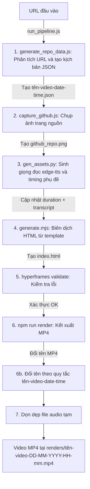

# 🚀 Quy Trình Tự Động Hóa Tạo Video Tech Từ URL

Tài liệu này hướng dẫn chi tiết cách tạo video review tự động từ một URL bất kỳ (GitHub, Docker Hub, hoặc web) sang video `.mp4` hoàn chỉnh.

---

## ⚡ Cách chạy nhanh nhất

Chỉ cần một lệnh duy nhất:

```bash
node run_pipeline.js <url>
```

**Ví dụ:**

```bash
# GitHub
node run_pipeline.js https://github.com/rany2/edge-tts

# Docker Hub
node run_pipeline.js https://hub.docker.com/_/nginx

# Web bất kỳ
node run_pipeline.js https://docs.python.org/3/tutorial/
```

## 🖥️ Xem trước trên Studio (Preview)

Để xem trước video mà không cần render MP4:

1. Chạy các bước sinh dữ liệu:
   ```bash
   node generate_repo_data.js <url>
   node capture_github.js <url>
   py gen_assets.py data/<tên-file>.json
   node generate.mjs data/<tên-file>.json
   ```

2. Khởi động server preview:
   ```bash
   npm run dev
   ```

3. Mở trình duyệt tại:
   ```
   http://localhost:3002
   ```

---

## Sơ đồ hoạt động của Pipeline



---

> [!IMPORTANT]
> Tất cả các lệnh được chạy từ thư mục gốc của dự án `my-video/`.

---

### Bước 1: Phân tích URL và tạo kịch bản (`generate_repo_data.js`)

- **Mô tả**: Nhận diện nền tảng (GitHub / Docker / Web), gọi API lấy metadata, phân loại nội dung và chọn format video phù hợp. Sinh file JSON kịch bản.
- **Lệnh**:
  ```bash
  node generate_repo_data.js https://hub.docker.com/_/nginx
  ```
- **Đầu ra**: File JSON tại `data/<tên-video>-<DD>-<MM>-<YYYY>-<HH>-<mm>.json`

**Hệ thống template:**

| Nền tảng | Template | Phong cách |
|---|---|---|
| GitHub | `G1_github` | Gradient vàng/xanh, khung trình duyệt |
| Docker | `G2_docker` | Xanh Docker, khung Terminal/Console |
| Web | `G3_web` | Gradient xanh/vàng, khung trình duyệt |

---

### Bước 2: Chụp ảnh trang nguồn (`capture_github.js`)

- **Mô tả**: Dùng Puppeteer mở URL, ẩn các thành phần gây nhiễu (header, footer, banner), chụp ảnh màn hình dọc.
- **Lệnh**:
  ```bash
  node capture_github.js https://hub.docker.com/_/nginx
  ```
- **Đầu ra**: `assets/images/github_repo.png`

---

### Bước 3: Tạo giọng đọc và timing phụ đề (`gen_assets.py`)

- **Mô tả**: Dùng **edge-tts** (giọng `vi-VN-NamMinhNeural` — nam miền Nam) để tạo audio tiếng Việt, tăng tốc 1.18x, tính transcript word-level.
- **Lệnh**:
  ```bash
  py gen_assets.py data/nginx-20-05-2026-16-06.json
  ```
- **Đầu ra**:
  - File audio: `assets/audio/<prefix>_scene_*.wav`
  - Cập nhật JSON: `audio_start`, `audio_duration`, `audio_path`, `transcript`

---

### Bước 4: Biên dịch HTML (`generate.mjs`)

- **Mô tả**: Đọc JSON kịch bản, load template tương ứng, sinh file `index.html` chứa toàn bộ composition video.
- **Lệnh**:
  ```bash
  node generate.mjs data/nginx-20-05-2026-16-06.json
  ```
- **Đầu ra**: `index.html`

---

### Bước 5: Kiểm tra composition (`npm run check`)

- **Mô tả**: Chạy lint, validate và inspect trên composition HTML.
- **Lệnh**:
  ```bash
  npm run check
  ```

---

### Bước 6: Kết xuất video MP4 (`npm run render`)

- **Mô tả**: HyperFrames đọc `index.html`, chụp từng frame bằng Puppeteer, encode bằng FFmpeg. Sau đó đổi tên MP4 theo quy tắc.
- **Lệnh**:
  ```bash
  npm run render
  ```
- **Đầu ra**: `renders/<tên-video>-<DD>-<MM>-<YYYY>-<HH>-<mm>.mp4`

---

## Cấu trúc dự án

```text
my-video/
├── assets/
│   ├── audio/                    # File audio TTS (tạm, bị xóa sau render)
│   ├── background-music/         # Nhạc nền
│   ├── character/shiba/          # Nhân vật Shiba
│   ├── images/                   # Ảnh chụp trang nguồn
│   ├── logo/                     # Logo kênh
│   └── sound-effect/             # Hiệu ứng âm thanh
├── compositions/                 # Sub-composition (intro)
├── data/                         # File JSON kịch bản
├── docs/                         # Tài liệu dự án
├── renders/                      # Video MP4 đầu ra
├── scripts/                      # Script tiện ích
├── templates/
│   ├── G1_github/                # Template GitHub
│   ├── G2_docker/                # Template Docker (Terminal)
│   └── G3_web/                   # Template Web
├── run_pipeline.js               # Entry point tự động
├── generate_repo_data.js         # Phân tích URL → JSON
├── capture_github.js             # Chụp ảnh trang nguồn
├── gen_assets.py                 # TTS + timing phụ đề
├── generate.mjs                  # JSON + template → index.html
├── index.html                    # Composition video hiện tại
├── meta.json                     # Metadata dự án
├── package.json                  # Scripts và dependencies
└── .env                          # API keys (TAVILY_API_KEY)
```
