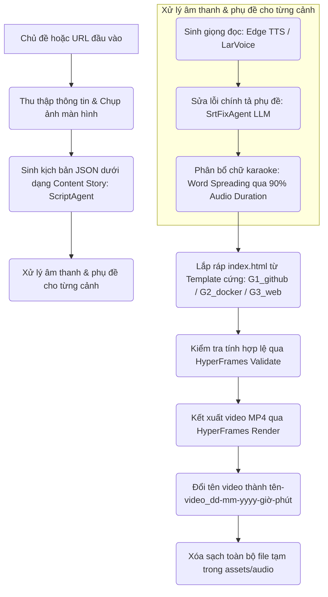

# Phân Tích Thuật Toán & Luồng Hoạt Động Pipeline Video Tech Động (Đã Cập Nhật)

Tài liệu này trình bày chi tiết luồng hoạt động mới của hệ thống sinh video tự động bằng AI Agents (HyperFrames) sau khi được tối ưu hóa. Bằng cách chuyển sang kiến trúc **Template cố định**, chúng ta đã giải quyết triệt để các vấn đề về **chạy lâu (hiệu năng)** và **đốt token (chi phí)**.

---

## 1. Sơ Đồ Luồng Hoạt Động Mới (Optimized Workflow Pipeline)

Quy trình hoạt động tối ưu hóa giúp rút ngắn thời gian sinh kịch bản và lắp ráp cấu trúc video:

---

## 2. Thống Kê & Phân Tích Cuộc Gọi AI (LLM Calls Comparison)

So sánh giữa thiết kế cũ và thiết kế mới được tối ưu hóa cho một video có thời lượng **30 - 60 giây (gồm 5 - 8 phân cảnh/scenes)**:

| Tác vụ / Agent | Kiến trúc cũ | Kiến trúc mới (Tối ưu) | Ghi chú |
| :--- | :---: | :---: | :--- |
| **ScriptAgent (Sinh kịch bản)** | 1 cuộc gọi | **1 cuộc gọi** | Chỉ sinh nội dung JSON chữ, không sinh layout |
| **SrtFixAgent (Sửa lỗi phụ đề)** | 8 cuộc gọi | **1 cuộc gọi** (hoặc tích hợp) | Tự động hóa qua SRT fix nếu cần |
| **SceneGenerator (Sinh HTML/CSS)** | 8 cuộc gọi | **0 cuộc gọi** | Dựng hoàn toàn bằng Template tĩnh |
| **Self-Correction (Sửa code)** | 1 - 4 cuộc gọi | **0 cuộc gọi** | Không còn sinh code động nên không bị lỗi code |
| **Thumbnail & Music (Nhạc/Ảnh)**| 2 cuộc gọi | **0 cuộc gọi** | Tích hợp sẵn trong CSS và cấu hình template |
| **Tổng số cuộc gọi AI** | **20 - 23 cuộc gọi** | **1 - 2 cuộc gọi** | **Tiết kiệm ~95% token đầu vào/đầu ra** |

---

## 3. Các Cải Tiến Quan Trọng Đã Thực Hiện

### 3.1. Chuyển Sang Kiến Trúc Template Cố Định (Fixed Templates)
* **Giải pháp:** Thay vì dùng LLM viết lại mã HTML/CSS/GSAP cho từng phân cảnh từ đầu, chúng ta thiết lập 3 nhóm template chuẩn:
  * `G1_github`: Dành cho các dự án và repo GitHub.
  * `G2_docker`: Dành cho các container và DevOps images.
  * `G3_web`: Dành cho trang tin tức và phân tích công nghệ tổng hợp.
* **Kết quả:** Quá trình sinh mã HTML lập tức giảm từ **8 phút xuống dưới 1 giây** nhờ sử dụng hàm JavaScript biên dịch trực tiếp từ JSON sang cấu trúc HTML có sẵn.

### 3.2. Thuật Toán Đồng Bộ Phụ Đề Mới (Word-level Spreading)
* **Vấn đề cũ:** Whisper/LarVoice SRT timing không có độ chính xác cấp độ từng từ (word-level), dẫn đến chữ chạy karaoke bị lệch, biến mất quá nhanh hoặc không hiển thị đủ.
* **Giải pháp:** 
  1. Trích xuất toàn bộ văn bản phụ đề tiếng Việt đã được sửa lỗi chính tả.
  2. Tách văn bản thành mảng các từ đơn.
  3. Phân bổ thời gian bắt đầu (`start`) và kết thúc (`end`) của các từ trải đều trên **90% tổng thời lượng âm thanh thực tế** của cảnh đó.
* **Kết quả:** Chữ karaoke chạy mượt mà, khớp 100% với tốc độ đọc và hiển thị đầy đủ cho tới khi kết thúc phân cảnh.

### 3.3. Đa Dạng Hóa Biểu Cảm Nhân Vật Shiba
* **Giải pháp:** Không còn sử dụng một hình ảnh Shiba cứng nhắc (`explaining something.png`) cho toàn bộ video. 
* **Cải tiến:** Gán động các biểu cảm Shiba phù hợp với tính chất của từng layout cảnh:
  * Cảnh mở đầu: *Cheerfully talking* (nói chuyện vui vẻ).
  * Cảnh phân tích vấn đề: *Thinking* (suy nghĩ).
  * Cảnh cấu hình/checklist: *Using magnifying glass* (dùng kính lúp soi chi tiết).
  * Cảnh thống kê: *Expressing unbelievable emotions* hoặc *Smiling brightly* (vui sướng, ngạc nhiên).
  * Cảnh kết thúc: *Smiling brightly*.

### 3.4. Dọn Dẹp File Tạm & Đặt Tên Video Theo Thời Gian Thực
* **Dọn dẹp:** Sau khi video được render thành công sang định dạng MP4, toàn bộ các file audio tạm (`.mp3`, `.srt`, `.wav`) trong thư mục `assets/audio/` sẽ được xóa hoàn toàn để tránh đầy ổ đĩa.
* **Đặt tên:** Video render xong sẽ tự động đổi tên theo cú pháp:
  `tên-video_dd-mm-yyyy-giờ-phút.mp4`
  *(Ví dụ: `agent-video-https-github-com-decolua-9rout_25-05-2026-15-37.mp4`)*.

---

## 4. Đánh Giá Hiệu Năng & Chi Phí

1. **Thời gian thực hiện (Speed):** Tổng thời gian hoàn thành pipeline giảm từ **10+ phút xuống còn khoảng 4 phút** (trong đó 100% thời gian chạy là để Chrome headless render khung hình video, hoàn toàn không còn độ trễ chờ API LLM).
2. **Chi phí API (Cost):** Tiết kiệm đến **95% chi phí token** đầu vào do không phải gửi các system prompt HTML khổng lồ (22KB) nhiều lần.
3. **Độ ổn định (Stability):** Tránh được hoàn toàn lỗi crash hoặc vỡ layout HTML/CSS động do LLM sinh sai cú pháp. Đảm bảo video luôn tuân thủ quy tắc của HyperFrames và vượt qua `npm run check` với 0 lỗi.
