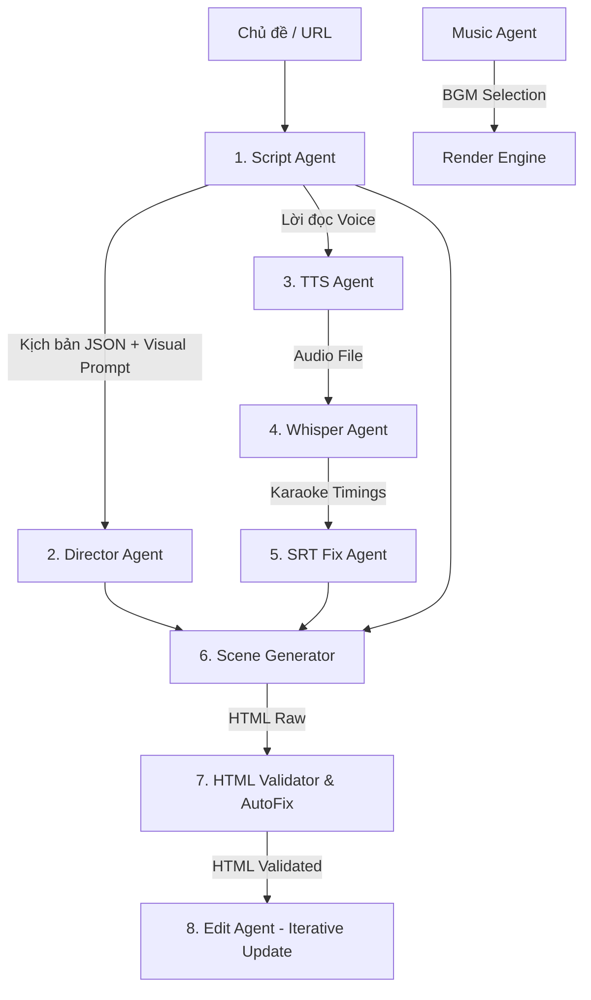

# 🤖 AI Agents Video Generation Pipeline

Dự án này là tập hợp các **AI Agents** thông minh được lập trình bằng JavaScript (Node.js), đóng vai trò là "bộ não" điều phối và xử lý trong hệ thống tạo video tự động. Nhiệm vụ chính của cụm Agent này là chuyển đổi một chủ đề (Topic) hoặc bài viết thành kịch bản phân cảnh, chỉ đạo nghệ thuật, tạo giọng đọc thuyết minh, đồng bộ phụ đề karaoke và biên dịch thành giao diện hoạt họa động dưới dạng HTML/CSS/JS chất lượng cao để sẵn sàng render thành video hoàn chỉnh.

---

## 🏗️ Kiến Trúc Hệ Thống Agents

Cụm agent này được thiết kế theo mô hình hướng module (Modular Agents), mỗi Agent đảm nhận một nhiệm vụ chuyên biệt trong luồng xử lý:



### Chi tiết các Agent:
1. **[scriptAgent.js](file:///c:/CONG_VIEC/agents/scriptAgent.js)**: 
   * **Nhiệm vụ**: Nhận chủ đề hoặc từ khóa, thiết lập độ dài, chia nhịp phân cảnh động và viết kịch bản chi tiết gồm 3 phần: lời thoại thuyết minh (`voice`), mô tả hoạt cảnh (`visual`) và phân bổ tài nguyên.
   * **Đầu ra**: Tệp kịch bản cấu trúc JSON chứa đầy đủ phân cảnh và bản mô tả Thumbnail.

2. **[directorAgent.js](file:///c:/CONG_VIEC/agents/directorAgent.js)**: 
   * **Nhiệm vụ**: Đóng vai trò là đạo diễn ảo. Nó phân tích ngữ nghĩa của kịch bản từng cảnh để quyết định các thông số cinematic: nhịp độ (`pacing`), kiểu chuyển động camera (`camera`), mức độ năng lượng thị giác (`energy`), hiệu ứng chuyển cảnh (`transition`) và cảm xúc màu sắc chủ đạo (`mood`).

3. **[ttsAgent.js](file:///c:/CONG_VIEC/agents/ttsAgent.js)**: 
   * **Nhiệm vụ**: Tạo giọng đọc AI thuyết minh từ nội dung văn bản sử dụng API LarVoice. Agent này hỗ trợ cơ chế xếp hàng tuần tự theo Session (Sequential Lock) và tự động xoay tua nhiều API key (Multi-key rotation) để tránh giới hạn băng thông.

4. **[whisperAgent.js](file:///c:/CONG_VIEC/agents/whisperAgent.js)**: 
   * **Nhiệm vụ**: Nhận diện âm thanh giọng đọc thuyết minh để tạo phụ đề khớp thời gian chuẩn xác đến từng từ (Word-level timestamps).

5. **[srtFixAgent.js](file:///c:/CONG_VIEC/agents/srtFixAgent.js)**: 
   * **Nhiệm vụ**: Rà soát, căn chỉnh lại thời gian hiển thị phụ đề karaoke để tránh các lỗi lệch nhịp hoặc hiển thị đè nhau.

6. **[musicAgent.js](file:///c:/CONG_VIEC/agents/musicAgent.js)**: 
   * **Nhiệm vụ**: Đọc hiểu sắc thái kịch bản và tự động lựa chọn bài nhạc nền (BGM) khớp với chủ đề nhất.

7. **[scene/generate.js](file:///c:/CONG_VIEC/agents/scene/generate.js)**: 
   * **Nhiệm vụ**: Sinh mã HTML động. Nó tổng hợp dữ liệu kịch bản, âm thanh thuyết minh, phụ đề và chỉ đạo nghệ thuật từ Director Agent để biên dịch thành một trang HTML/CSS/JS hoàn chỉnh chứa hoạt ảnh động mượt mà bằng thư viện GSAP.

8. **[scene/htmlValidator.js](file:///c:/CONG_VIEC/agents/scene/htmlValidator.js)**: 
   * **Nhiệm vụ**: Quét phân tích tĩnh trang HTML được sinh ra để phát hiện lỗi tràn màn hình, lỗi màu chữ tương phản, thiếu tệp tin hoặc lỗi logic GSAP và thực hiện tự động sửa lỗi (AutoFix).

9. **[scene/edit.js](file:///c:/CONG_VIEC/agents/scene/edit.js)**: 
   * **Nhiệm vụ**: Tiếp nhận feedback chỉnh sửa từ người dùng hoặc hệ thống để tinh chỉnh và cập nhật trực tiếp vào mã nguồn HTML cảnh mà không làm ảnh hưởng đến các phân cảnh khác.

---

## 🛠️ Yêu Cầu Hệ Thống

Để cụm Agent chạy chính xác và tích hợp được với luồng render video, hệ thống của bạn cần cài đặt:
* **Node.js** (Phiên bản v20 trở lên)
* **FFmpeg & FFprobe** (Dùng cho việc đo đạc âm thanh và xử lý video ở bước render)
* Các API Keys:
  * **OpenAI / OpenRouter API Key** (Dùng trong `services/aiRouter.js` để chạy mô hình AI)
  * **LarVoice API Key** (Cung cấp giọng đọc thuyết minh)

---

## 🚀 Hướng Dẫn Tích Hợp Và Chạy Dự Án

Cụm agent này thường không chạy đơn lẻ mà được tích hợp trực tiếp vào một Pipeline điều phối (ví dụ: **[VNP_HyperFrames](file:///c:/CONG_VIEC/VNP_HyperFrames)**).

### 1. Cách chạy thông qua Pipeline tự động hóa (Khuyên dùng)
Nếu bạn đang sử dụng hệ thống **VNP_HyperFrames**, các Agent sẽ tự động được triệu gọi qua file script điều phối:

* **Tạo video tự động từ một đường dẫn bất kỳ (CLI)**:
  ```bash
  # Chạy từ thư mục VNP_HyperFrames
  node pipeline/run_pipeline.js <URL_của_bài_viết_hoặc_github_repo>
  ```
  *Ví dụ:* `node pipeline/run_pipeline.js https://github.com/heygen-com/hyperframes`

* **Giao Diện Đồ Họa Web Dashboard**:
  ```bash
  # Khởi động máy chủ giao diện
  npm run start
  
  # Truy cập Dashboard tại: http://localhost:3001
  ```
  Nhập URL, cấu hình giọng đọc, hệ thống Agent sẽ chạy ngầm và trả về video kết quả hiển thị trên trình duyệt.

### 2. Cách chạy hoặc test riêng lẻ từng Agent
Nếu muốn kiểm tra hoạt động độc lập của một Agent, bạn có thể tạo một file script test (ví dụ `test.js`) ở thư mục cha và import trực tiếp Agent đó:

```javascript
// Ví dụ chạy thử scriptAgent.js để tạo kịch bản
import { generateScript } from './agents/scriptAgent.js';

const config = {
  topic: "Tương lai của trí tuệ nhân tạo năm 2026",
  keys: {
    // điền các token cần thiết
  },
  videoDurationSec: 60,
  sceneDurationSec: 7,
  onLog: (msg) => console.log(`[ScriptAgent Log]: ${msg}`)
};

const result = await generateScript(config);
console.log("Kịch bản sinh ra:", JSON.stringify(result, null, 2));
```

Chạy file test bằng lệnh:
```bash
node test.js
```

---

## 📁 Cấu Trúc Thư Mục Agents

```text
agents/
├── scene/
│   ├── aspect-ratios.js       # Cấu hình tỉ lệ khung hình (9:16, 16:9, 1:1)
│   ├── compositionBuilder.js  # Lớp hỗ trợ dựng bố cục HTML
│   ├── edit.js                # Agent chỉnh sửa mã nguồn HTML cảnh phim
│   ├── generate.js            # Agent chính sinh mã HTML/CSS hoạt ảnh cảnh phim
│   ├── htmlValidator.js       # Bộ quét kiểm tra lỗi HTML và AutoFix
│   ├── index.js               # File xuất bản các hàm công khai (Re-exports)
│   ├── prompts.js             # Hệ thống Prompts tiếng Việt cho LLM
│   ├── prompts-en.js          # Hệ thống Prompts tiếng Anh cho LLM
│   └── visualStyleSelector.js # Lựa chọn bảng màu và phong cách thiết kế
├── directorAgent.js           # Chỉ đạo nghệ thuật và thông số camera
├── scriptAgent.js             # Lên kịch bản chi tiết phân cảnh tiếng Việt
├── ttsAgent.js                # Kết nối LarVoice sinh âm thanh thuyết minh
├── whisperAgent.js            # Tách tiếng lấy phụ đề karaoke khớp thời gian
├── srtFixAgent.js             # Rà soát sửa lỗi phụ đề
└── musicAgent.js              # Lựa chọn nhạc nền phù hợp
```

---

## ⚙️ Cấu Hình Môi Trường

Đảm bảo tạo file `.env` tại thư mục gốc của dự án chính với đầy đủ các cấu hình sau:
```env
# API Keys cho AI Models
OPENAI_API_KEY=your_openai_key
OPENROUTER_API_KEY=your_openrouter_key

# API Keys cho Giọng đọc AI
LARVOICE_API_KEY=your_larvoice_key_1,your_larvoice_key_2
```
