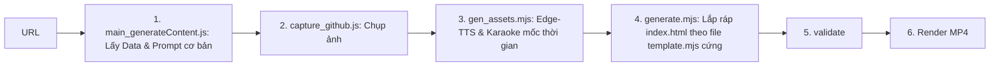

# Kế Hoạch Tích Hợp Hệ Thống Agents Vào Dự Án VNP_HyperFrames

Tài liệu này phác thảo kế hoạch chi tiết để tích hợp cụm **AI Agents** hiện có vào đường ống xử lý video (Pipeline) của dự án **[VNP_HyperFrames](file:///c:/CONG_VIEC/VNP_HyperFrames)**. Mục tiêu là thay thế các bước tự động hóa tĩnh (Static Automation) bằng quy trình điều phối thông minh của Agent (Agentic Workflow) nhằm cải thiện chất lượng thẩm mỹ, hoạt ảnh và tính linh hoạt của video thành phẩm.

---

## 1. Phân Tích Sự Khác Biệt Giữa 2 Hệ Thống

Hiện tại, **VNP_HyperFrames** đang hoạt động theo mô hình tuần tự tuyến tính thông thường:



**Hạn chế của mô hình cũ**:
* Các cảnh (scenes) và hoạt ảnh GSAP được định nghĩa sẵn trong các file mẫu `templates/G1_github/scenes.mjs` một cách cố định. AI chỉ điền nội dung chữ, không thể tự thiết kế chuyển động phức tạp.
* Giọng đọc sinh ra qua dịch vụ Edge-TTS mặc định đôi khi thiếu cảm xúc và không có cơ chế quản lý giới hạn API tốt.

**Giải pháp sau khi tích hợp Agents**:
* **Lên kịch bản thông minh**: [scriptAgent.js](file:///c:/CONG_VIEC/agents/scriptAgent.js) sinh ra cả mô tả cấu trúc cinematic chi tiết từng lớp cho cảnh.
* **Chỉ đạo nghệ thuật động**: [directorAgent.js](file:///c:/CONG_VIEC/agents/directorAgent.js) tính toán và quyết định cấu hình camera, pacing riêng biệt cho mỗi cảnh.
* **Giọng đọc & Phụ đề cao cấp**: [ttsAgent.js](file:///c:/CONG_VIEC/agents/ttsAgent.js) (LarVoice) kết hợp [whisperAgent.js](file:///c:/CONG_VIEC/agents/whisperAgent.js) sinh audio tự nhiên và karaoke chuẩn xác.
* **Tự sinh giao diện (Cinematic HTML Generation)**: [scene/generate.js](file:///c:/CONG_VIEC/agents/scene/generate.js) kết hợp với mô hình LLM để tự động thiết kế cấu trúc HTML & CSS từ kịch bản, không bị bó buộc bởi template tĩnh.

---

## 2. Bản Đồ Ánh Xạ Tích Hợp (Integration Mapping)

Dưới đây là cách chúng ta sẽ thay thế các bước trong Pipeline cũ bằng các module của Agents:

| Bước Pipeline Cũ | Module Agent Mới Thay Thế | Mô Tả Thay Đổi |
| :--- | :--- | :--- |
| **Bước 1**: `main_generateContent.js` | **[scriptAgent.js](file:///c:/CONG_VIEC/agents/scriptAgent.js)** | Lên kịch bản với cấu trúc chi tiết 7 thành phần cinematic cho mỗi cảnh thay vì chỉ viết text thuần. |
| **Bước 3**: `gen_assets.mjs` | **[ttsAgent.js](file:///c:/CONG_VIEC/agents/ttsAgent.js)** + **[whisperAgent.js](file:///c:/CONG_VIEC/agents/whisperAgent.js)** + **[srtFixAgent.js](file:///c:/CONG_VIEC/agents/srtFixAgent.js)** | Dùng LarVoice cho thuyết minh chất lượng cao, chạy Whisper nhận diện karaoke từng từ, dùng srtFixAgent căn chỉnh mốc thời gian phụ đề. |
| **Bước 4**: `generate.mjs` | **[scene/generate.js](file:///c:/CONG_VIEC/agents/scene/generate.js)** | Dựng giao diện HTML/CSS độc lập cho từng cảnh dựa trên style-guide, aspect ratio và chuyển động camera từ [directorAgent.js](file:///c:/CONG_VIEC/agents/directorAgent.js). |
| **Bước 5**: `hyperframes validate` | **[scene/htmlValidator.js](file:///c:/CONG_VIEC/agents/scene/htmlValidator.js)** + `hyperframes validate` | Thực hiện tự sửa các lỗi UI/GSAP phổ biến bằng AI trước khi đưa vào validator của HyperFrames. |
| *(Mới)* **Bước 8**: Feedback Loop | **[scene/edit.js](file:///c:/CONG_VIEC/agents/scene/edit.js)** | Cho phép người dùng chỉnh sửa nội dung từng cảnh bằng prompt văn bản trực tiếp trên UI dashboard. |

---

## 3. Các Bước Triển Khai Chi Tiết

### Bước 1: Sao chép mã nguồn và tích hợp cấu trúc thư mục
* Di chuyển/sao chép thư mục [agents/](file:///c:/CONG_VIEC/agents) vào thư mục gốc của dự án [VNP_HyperFrames/](file:///c:/CONG_VIEC/VNP_HyperFrames).
* Cấu trúc thư mục mục tiêu:
  ```text
  VNP_HyperFrames/
  ├── agents/                  # Thư mục chứa các AI Agents mới chuyển qua
  │   ├── scene/
  │   ├── directorAgent.js
  │   └── ...
  ├── services/
  │   └── aiRouter.js          # Router xử lý gọi LLM (đã có sẵn hoặc tạo mới)
  ├── renderer/
  │   ├── motionMapper.js      # Module ánh xạ chuyển động sang GSAP spec
  │   └── timelineBuilder.js   # Module xây dựng timeline hoạt ảnh
  ├── pipeline/
  │   ├── run_pipeline.js      # Pipeline cũ
  │   └── run_agent_pipeline.js# Pipeline mới sử dụng Agent
  └── package.json
  ```

### Bước 2: Đồng bộ Dependencies (package.json)
Cần bổ sung các thư viện cần thiết của Agents vào `VNP_HyperFrames/package.json`:
* `openai` (phiên bản ^6.x) hoặc `@openrouter/sdk`
* `node-fetch` (nếu chạy trên môi trường Node cũ không hỗ trợ global fetch)
```json
"dependencies": {
  ...
  "openai": "^6.36.0",
  "@openrouter/sdk": "^0.12.30"
}
```
Sau đó chạy `npm install` để cài đặt.

### Bước 3: Cấu hình biến môi trường (`.env`)
Bổ sung các khóa API cần thiết cho Agents:
```env
# AI Models (OpenAI / OpenRouter)
OPENAI_API_KEY=your_openai_api_key
OPENROUTER_API_KEY=your_openrouter_api_key

# Giọng đọc AI LarVoice
LARVOICE_API_KEY=key_1,key_2
LARVOICE_VOICE_ID=1
```

### Bước 4: Viết kịch bản điều phối mới (`pipeline/run_agent_pipeline.js`)
Tạo một file điều phối mới để kết nối các Agent theo quy trình tuần tự. Cấu trúc mã nguồn cơ bản:

```javascript
import fs from 'fs';
import path from 'path';
import { generateScript } from '../agents/scriptAgent.js';
import { buildDirection } from '../agents/directorAgent.js';
import { generateTTS } from '../agents/ttsAgent.js';
import { transcribeAudio } from '../agents/whisperAgent.js'; // giả định Whisper module
import { generateSceneHTML } from '../agents/scene/generate.js';

async function runAgentPipeline(topic) {
  console.log(`[Pipeline] Bắt đầu luồng Agent với chủ đề: ${topic}`);
  
  // 1. Sinh kịch bản JSON
  const { scenes, thumbnail } = await generateScript({ topic, videoDurationSec: 60 });
  
  // 2. Chạy vòng lặp xử lý từng cảnh
  const generatedScenes = [];
  for (const scene of scenes) {
    console.log(`[Pipeline] Xử lý Cảnh ${scene.stt}...`);
    
    // 2a. Sinh âm thuyết minh TTS
    const audioPath = `assets/audio/scene_${scene.stt}.mp3`;
    await generateTTS(scene.voice, audioPath);
    
    // 2b. Lấy mốc thời gian karaoke bằng Whisper
    const srtContent = await transcribeAudio(audioPath);
    scene.srt = srtContent;
    
    // 2c. Chỉ đạo nghệ thuật (Director)
    const direction = buildDirection(scene, { totalScenes: scenes.length });
    
    // 2d. Sinh mã HTML/CSS hoạt cảnh động
    const sceneHtml = await generateSceneHTML({
      scene,
      outputAspectRatio: '9:16',
      consistentScenes: true
    });
    
    generatedScenes.push({ ...scene, html: sceneHtml, audioPath });
  }
  
  // 3. Lắp ráp các cảnh thành composition tổng của HyperFrames
  // (Đầu ra sẽ ghi đè lên file index.html ở thư mục gốc của VNP_HyperFrames)
  
  // 4. Kích hoạt 'npm run render' để xuất video MP4
}
```

### Bước 5: Tích hợp với Web UI Dashboard
Nếu sử dụng giao diện web (`desktop_app/ui_server.js`):
* Cập nhật endpoint API tạo video trên UI server để chuyển tiếp lệnh thực thi sang `run_agent_pipeline.js` thay vì `run_pipeline.js` cũ.
* Bổ sung tính năng cho phép nhập API keys (LarVoice, OpenAI) ngay trên giao diện cài đặt và truyền các tham số này vào các Agent thông qua tham số `keys` ở mỗi lời gọi hàm.

---

## 4. Kế Hoạch Kiểm Thử (Testing Checklist)

Để đảm bảo tích hợp thành công, cần kiểm tra các điểm sau:
- [ ] **Test API**: Chạy kiểm tra kết nối AI Router và LarVoice API thành công với API key mới.
- [ ] **Test Phân Cảnh (Script & Art Direction)**: Đảm bảo kịch bản JSON trả về đúng schema và `directorAgent.js` phân tích đúng camera, mood, energy.
- [ ] **Test Đồng bộ (Audio + Subtitles)**: Phụ đề sinh ra khớp từng từ với file âm thanh TTS và hiển thị mượt trên giao diện HTML.
- [ ] **Test Kiểm Tra Tĩnh (HTML Validation)**: Chạy `npx hyperframes validate` trên file `index.html` được Agent sinh ra để đảm bảo không lỗi cú pháp hoặc tràn khung hình.
- [ ] **Test Kết Xuất (Rendering)**: Video render hoàn chỉnh định dạng `.mp4` trong thư mục `renders/` có âm thanh, nhạc nền và hình ảnh đồng bộ.
