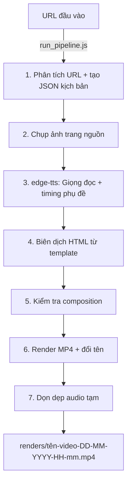

# 🚀 Quy Trình Tự Động Hóa Tạo Video Tech Từ URL (Workflow)

Tài liệu nội bộ hướng dẫn chi tiết từng bước tạo video review từ URL sang video `.mp4` hoàn chỉnh.

---

## ⚡ Cách chạy nhanh nhất

```bash
node run_pipeline.js <url>
```

**Ví dụ:**

```bash
node run_pipeline.js https://github.com/rany2/edge-tts
node run_pipeline.js https://hub.docker.com/_/nginx
node run_pipeline.js https://docs.python.org/3/tutorial/
```

### Sơ đồ hoạt động:



---

> [!IMPORTANT]
> Tất cả các lệnh chạy từ thư mục gốc `my-video/`.

### Bước 1: Thu thập thông tin và tạo kịch bản (`generate_repo_data.js`)

- Nhận diện nền tảng (GitHub / Docker / Web), gọi API, phân loại nội dung, chọn template và format video.
- **Đầu ra**: `data/<tên-video>-<DD>-<MM>-<YYYY>-<HH>-<mm>.json`

---

### Bước 2: Chụp ảnh tự động (`capture_github.js`)

- Puppeteer mở URL, ẩn banner/header/footer, chụp ảnh màn hình dọc.
- **Đầu ra**: `assets/images/github_repo.png`

---

### Bước 3: Tạo giọng đọc và phụ đề (`gen_assets.py`)

- Dùng **edge-tts** giọng `vi-VN-NamMinhNeural` (nam, miền Nam).
- Tăng tốc 1.18x, tính transcript word-level (hệ số 85%).
- Truyền text qua file tạm UTF-8 để tránh lỗi mã hóa trên Windows.
- **Đầu ra**: file `.wav` trong `assets/audio/` + cập nhật JSON.

---

### Bước 4: Biên dịch HTML (`generate.mjs`)

- Đọc JSON, load template (`G1_github` / `G2_docker` / `G3_web`), sinh `index.html`.

---

### Bước 5: Kiểm tra (`npm run check`)

- Chạy lint + validate + inspect trên composition.

---

### Bước 6: Render MP4 (`npm run render`)

- HyperFrames render từng frame, encode bằng FFmpeg.
- Tự động đổi tên MP4 theo quy tắc `<tên-video>-<DD>-<MM>-<YYYY>-<HH>-<mm>.mp4`.

---

### Bước 7: Dọn dẹp

- Xóa file `.wav` tạm trong `assets/audio/`.

---

## 🖥️ Xem trước (Preview)

```bash
npm run dev
# Mở http://localhost:3002
```

## Hệ thống template

| Nền tảng | Template | Phong cách thiết kế |
|---|---|---|
| GitHub | `G1_github` | Gradient vàng/xanh, khung trình duyệt web |
| Docker | `G2_docker` | Xanh Docker (#0db7ed), khung Terminal/Console, font monospace |
| Web | `G3_web` | Gradient xanh dương/vàng, khung trình duyệt |

## Cấu hình TTS

| Tham số | Giá trị |
|---|---|
| Engine | `edge-tts` (Microsoft Edge online TTS) |
| Giọng đọc | `vi-VN-NamMinhNeural` (nam, miền Nam) |
| Giọng thay thế | `vi-VN-HoaiMyNeural` (nữ) |
| Tốc độ tăng | 1.18x |
| Text pacing | 85% thời lượng audio |
